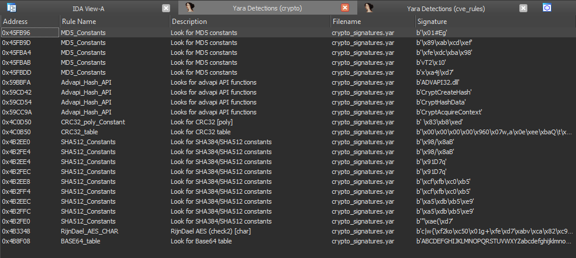

# YaraScan

## Installation
Before using, you must install Yara python plugin with ``pip install yara-python==4.2.3``

## Using
Press hot-key combination ``Shift-Y`` and select your Yara rules directory.
